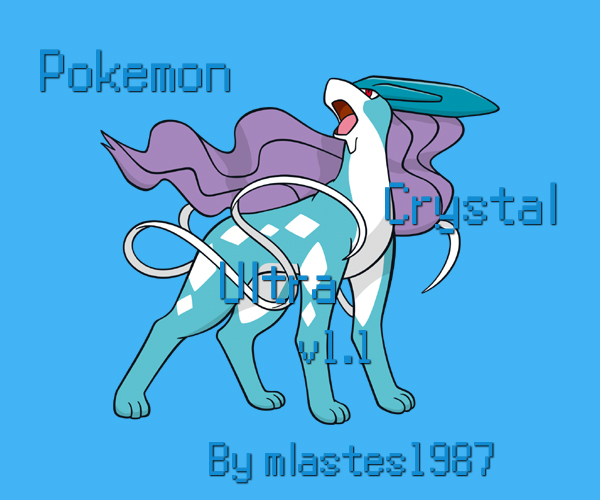

# Pokemon Crystal Ultra

Based on [**Nayru62's New Dex Newbox**](https://github.com/RaJah239/Nayru62-s-Dex-Newbox) by RaJah239.

**Quality of life features**
- Pocket PC (received after you choose your starter)
- Gen 6 EXP Share (received after you see Mr. Pokemon)
- Reusable TMs
- Tradeback NPC (Goldenrod Dept. Store B1F) for all trade evolutions
- Restored GS Ball Celebi Event (After defeating Elite Four)
- Kurt makes Pokeballs instantly
- Master Ball/Rare Candy Girl (in Cherrygrove City)
- 60 fps overworld and smooth fading added
- Dynamic overworld sprites and palettes added
- Evening added from 5:00pm - 8:00pm and it uses 60% of day encounters and 40% of the night encounters
- View free space on each compile (pokecrystal.gbc or pokecrystal_debug.gbc)
- Instant Text added, removed Slow and Medium text speeds
- Removed the artificial save delay
- Select + B to resets the game
- Press Up and Start on Suicune running screen to bring up the option to delete save file
- Run anywhere (hold  B to walk), Surf faster by default (Hold B to slow surf)
- Day and Time added to Start Menu
- Added a Medicine, Fruit, Battle and Loot Pack pockets
- Added item sorting to Pack in and out of battles
- "Trivial Calls" replaced "Menu Account" in Options menu
- Display coloured Pokémon pictures in over world
- Poké-Centre fast heal added
- Show shiny icon in battle for own Pokémon too
- Gender correct battle/trade link rooms
- Show quantity already in Pack at Marts, (TMs don't show quantity) by DanielOlivaw
- Show move names for TMs and HMs when receiving or buying
- Allow using a field move if the Pokémon can learn it (This includes HMs, so it is possible to get stuck in Cianwood city)
- Correct grammar for plural trainers like Twins
- Prompt to automatically reuse Repel when one runs out
- Improved the trainer rematch system
- Name Rater can change Traded Pokémon names
- Eggs can be released
- Eggs hatch at Level 1
- All stats can be maxed with vitamins regardless if trained or not
- Added a new radio channel
- Voltorb flip added to Game Corners by froggestspirit
- Move Deleter and Name Rater's menu loops to party after use
- Press A or B to stop the Bicycle in any downhill environments that forces bike usage
- Don't play bike music in National Park or surf music in the Lake of Rage
- Headbutting trees, smashing rocks and fishing has a chance to yield items
- Allow fishing while surfing
- New Fly Points added for Route 20/Blaine’s Gym, Route 32, Route 26, Tohjo Falls/Route 27, Battle Tower, National Park, Mt. Moon and Rock Tunnel

**Graphics**
- New surfing sprite added
- Cooltrainer Male's overworld sprite eye fix by Major Agnostic
- Animate tiles even when textboxes are open
- Shiny Pokémon's eggs have a blue palette

**Gym Badges**
- Show the tops of leaders heads on the trainer card
- Added a third trainer card page for Kanto badges
- Coloured the Johto badges in the Trainer Card
- Coloured the Kanto badges in the Trainer Card
- Updated Rainbow Badge's palettes
- Janine gives the Marsh Badge and Sabrina gives Soul Badge now

**Battle Related**
- Battle HUD Update by Idain
- Can swap held items in Pokémon Party Menu
- Physical/Special split added
- Updated AI
- More information added to Move Menu
- Added "MOVES" menu option in battle
- Use unique colours for each thrown Pokéball
- Gain experience from catching Pokémon
- Removed the 25% failure chance for AI status moves
- Enemy trainers have maximum happiness for a powerful Return
- Quick Claw activation text added
- Prevent Steel‐types from being poisoned by Twineedle
- Prevent burning fire types and freezing ice types by Tri-Attack
- Player Loss text added (Only used in the Cherrygrove and Burn Tower battles)
- Short beeping noise for low HP
- Lose money proportional to badges and lead level Pokémon
- Replaced stat experience with EVs & Can max out EVs on all stats (can be modified by tutorial in pokecrsytal's wiki to work like main series)
- Don't gain experience at level 100 or Level Cap (if implemented)
Still get EVs
- Show an icon for the current weather
- Removed the gym badges boosts
- Survive poisoning with 1 HP
- Added a new battle transition for Rocket members
- Gold Berry recovers 1/4 of max HP by PurnPum
- Party Menu status tiles added
- Player and Enemy's Pokémon status doesn't cover its level
- Display TOX instead of PSN if badly poisoned by PurnPum
- Backups and restores held items after battle (Only used for RED so far) by AtmaBuster

**Tutorials Used**
- Improved the event initialization system
- Reduced the command queue system to just stone tables
- Improved the outdoor sprite system
- Allow more trainer parties with individual DVs, EVs, and nicknames + allowing trainer data to be stored in multiple banks
- Increase Pokémon sprite animation size
- Expand tilesets from 192 to 255 tiles

**Graphics**
- Bag graphic by TimKun55
- Uncensored beauty, fisherman, sage, medium and swimmer_f's trainer sprites
